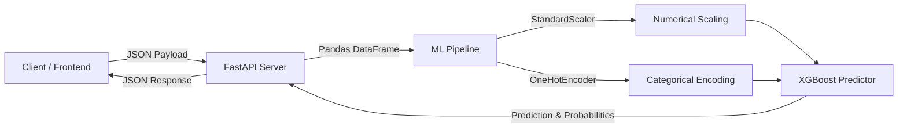

# 📊 Customer Churn Predictor API

This project delivers a production-ready machine learning pipeline and API for predicting customer churn in a telecommunications service. It leverages a custom-trained **XGBoost Classifier** wrapped in a Scikit-Learn preprocessing pipeline and served via **FastAPI**.

---

## 🚀 Project Architecture

The system consists of a preprocessing and model training pipeline exported as a serialized joblib object, which is then loaded by a FastAPI backend to serve real-time predictions.



---

## 📁 Repository Structure

```text
├── Backend/
│   └── main.py          # FastAPI application & entry point
├── Data/
│   └── WA_Fn-UseC_-Telco-Customer-Churn.csv  # Original Dataset
├── Models/
│   └── churn_pipeline.joblib  # Serialized ML preprocessor + model pipeline
├── Notebooks/
│   ├── dataset.ipynb    # Jupyter Notebook for EDA
│   └── Model.ipynb      # Jupyter Notebook for Model training & tuning
├── Notes.md             # Developer notes and model comparison logs
├── requirements.txt     # Python dependencies
└── README.md            # Project documentation (this file)
```

---

## 🛠️ Tech Stack & Libraries

- **Machine Learning**: `xgboost`, `scikit-learn` (StandardScaler, OneHotEncoder, Pipeline)
- **Data Engineering**: `pandas`, `numpy`
- **Web API**: `fastapi`, `pydantic`, `uvicorn`
- **Serialization**: `joblib`

---

## 📡 API Documentation & Request Schema

The FastAPI application exposes a single prediction endpoint.

### **Endpoint**: `POST /predict`
- **Content-Type**: `application/json`

#### **Request Body Schema (JSON)**

Your JSON payload must match the Pydantic schema structure. Below is the list of fields, their data types, descriptions, and the exact possible values that should be mapped in the frontend forms (e.g., as dropdown items or numeric inputs):

| Field Name | Data Type | UI Input Type | Description / Valid Values / Dropdown Options |
| :--- | :--- | :--- | :--- |
| **`Partner`** | `string` | Dropdown | Whether the customer has a partner.<br>• `Yes`<br>• `No` |
| **`Dependents`** | `string` | Dropdown | Whether the customer has dependents.<br>• `Yes`<br>• `No` |
| **`Contract`** | `string` | Dropdown | The contract term of the customer.<br>• `Month-to-month`<br>• `One year`<br>• `Two year` |
| **`tenure`** | `integer` | Number Input | Number of months the customer has stayed with the company (e.g., `0` to `72`). |
| **`MonthlyCharges`** | `float` | Number Input | The amount charged to the customer monthly (e.g., `18.25` to `118.75`). |
| **`OnlineSecurity`** | `string` | Dropdown | Whether the customer has online security.<br>• `Yes`<br>• `No`<br>• `No internet service` |
| **`TechSupport`** | `string` | Dropdown | Whether the customer has tech support.<br>• `Yes`<br>• `No`<br>• `No internet service` |
| **`InternetService`** | `string` | Dropdown | Customer's internet service provider.<br>• `DSL`<br>• `Fiber optic`<br>• `No` |
| **`PaymentMethod`** | `string` | Dropdown | The customer's payment method.<br>• `Electronic check`<br>• `Mailed check`<br>• `Bank transfer (automatic)`<br>• `Credit card (automatic)` |

> [!IMPORTANT]
> The case of the field names must match exactly as defined above (e.g., `tenure` is lowercase, while `MonthlyCharges` is camelCase). Also, option strings (like `"Fiber optic"` or `"Month-to-month"`) are case-sensitive and must match the model's expected categories.

---

### **JSON Payload Example**

```json
{
  "Partner": "Yes",
  "Dependents": "No",
  "Contract": "Month-to-month",
  "tenure": 12,
  "MonthlyCharges": 70.0,
  "OnlineSecurity": "No",
  "TechSupport": "Yes",
  "InternetService": "Fiber optic",
  "PaymentMethod": "Electronic check"
}
```

### **JSON Response Example**

```json
{
  "prediction": "Customer Will Stay",
  "probability": 0.35
}
```

---

## ⚙️ How to Setup and Run

### 1. Prerequisites
Make sure Python 3.8+ is installed on your system.

### 2. Install Dependencies
Restore the packages defined in [requirements.txt](file:///d:/Shared/ES/ML/P/requirements.txt):
```bash
pip install -r requirements.txt
```

### 3. Run the FastAPI Server
Launch the server using Uvicorn:
```bash
uvicorn Backend.main:app --reload
```

The server will start running on `http://127.0.0.1:8000`.

### 4. Interactive Swagger Documentation
Once the server is running, you can access the automatically generated interactive API docs:
- **Swagger UI**: [http://127.0.0.1:8000/docs](http://127.0.0.1:8000/docs)
- **ReDoc**: [http://127.0.0.1:8000/redoc](http://127.0.0.1:8000/redoc)

---

### Test Live Preview
Test the live Model Hosted :
- **ReDoc**: [https://ccp-ml.onrender.com/doc](https://ccp-ml.onrender.com/doc)

---

## 🎨 UI Form Representation (Mockup Guidance)

For building a frontend interface to interact with this API, use the following layout guidance:

```text
+-------------------------------------------------------------+
|               Customer Churn Predictor Form                 |
+-------------------------------------------------------------+
|  Partner:                 [ Select: Yes | No              ] |
|  Dependents:              [ Select: Yes | No              ] |
|  Contract:                [ Select: Month-to-month | ...  ] |
|  Tenure (Months):         [ e.g. 12                       ] |
|  Monthly Charges ($):     [ e.g. 70.45                    ] |
|  Online Security:         [ Select: Yes | No | No internet] |
|  Tech Support:            [ Select: Yes | No | No internet] |
|  Internet Service:        [ Select: DSL | Fiber optic | No] |
|  Payment Method:          [ Select: Electronic check | ...] |
+-------------------------------------------------------------+
|                       [ PREDICT CHURN ]                     |
+-------------------------------------------------------------+
```
